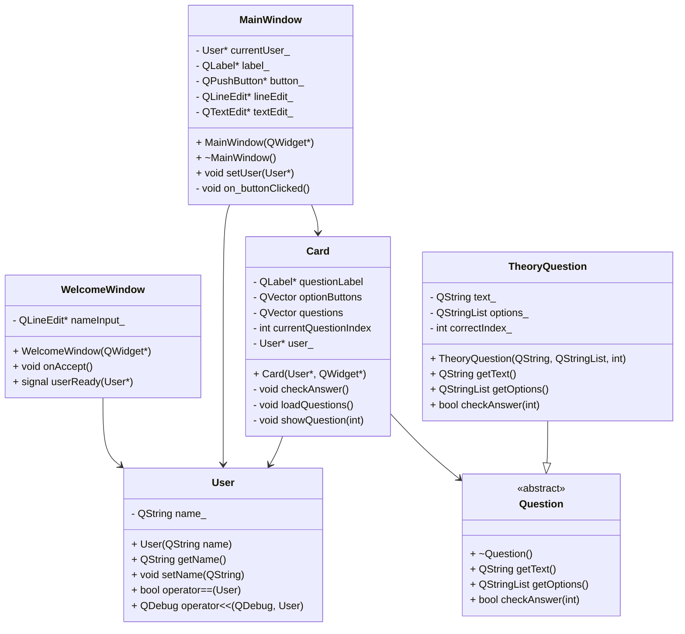

# mi_card_flutter

A new Flutter project.

## Getting Started

This project is a starting point for a Flutter application.

## 🧠 Diagrama de Clases UML

```mermaid
classDiagram
    class User {
        - QString name_
        + User(QString name)
        + QString getName()
        + void setName(QString)
        + bool operator==(User)
        + QDebug operator<<(QDebug, User)
    }
    class Question {
        <<abstract>>
        + ~Question()
        + QString getText()
        + QStringList getOptions()
        + bool checkAnswer(int)
    }
    class TheoryQuestion {
        - QString text_
        - QStringList options_
        - int correctIndex_
        + TheoryQuestion(QString, QStringList, int)
        + QString getText()
        + QStringList getOptions()
        + bool checkAnswer(int)
    }
    class Card {
        - QLabel* questionLabel
        - QVector<QPushButton*> optionButtons
        - QVector<Question*> questions
        - int currentQuestionIndex
        - User* user_
        + Card(User*, QWidget*)
        - void checkAnswer()
        - void loadQuestions()
        - void showQuestion(int)
    }
    class MainWindow {
        - User* currentUser_
        - QLabel* label_
        - QPushButton* button_
        - QLineEdit* lineEdit_
        - QTextEdit* textEdit_
        + MainWindow(QWidget*)
        + ~MainWindow()
        + void setUser(User*)
        - void on_buttonClicked()
    }
    class WelcomeWindow {
        - QLineEdit* nameInput_
        + WelcomeWindow(QWidget*)
        + void onAccept()
        + signal userReady(User*)
    }
    %% Relaciones
    TheoryQuestion --|> Question
    Card --> User
    Card --> Question
    MainWindow --> User
    MainWindow --> Card
    WelcomeWindow --> User
```
